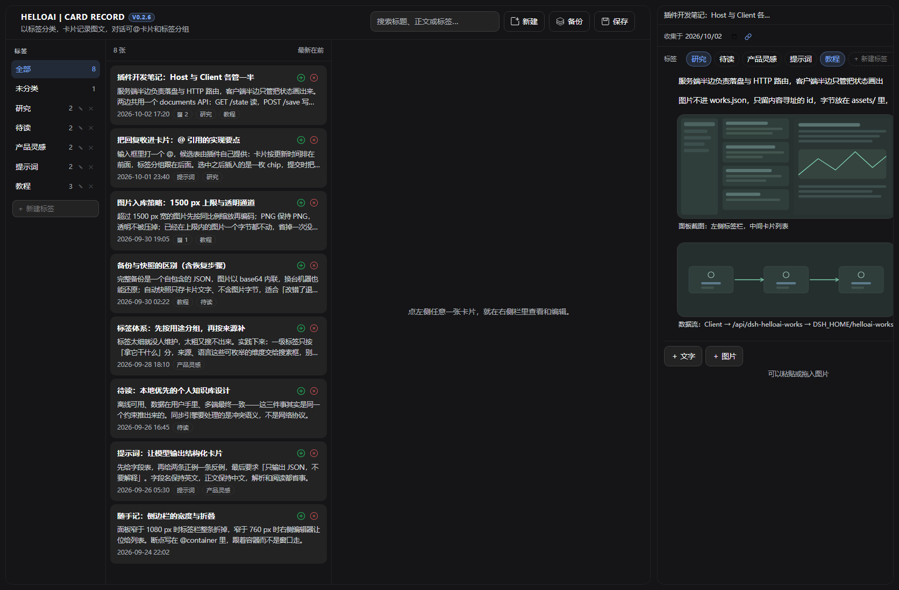
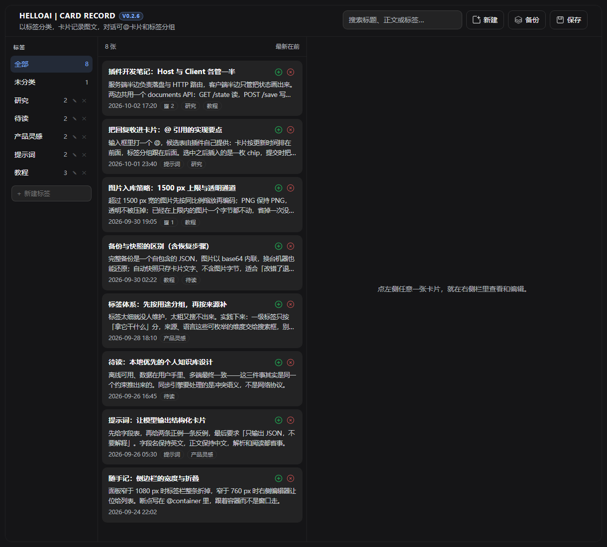
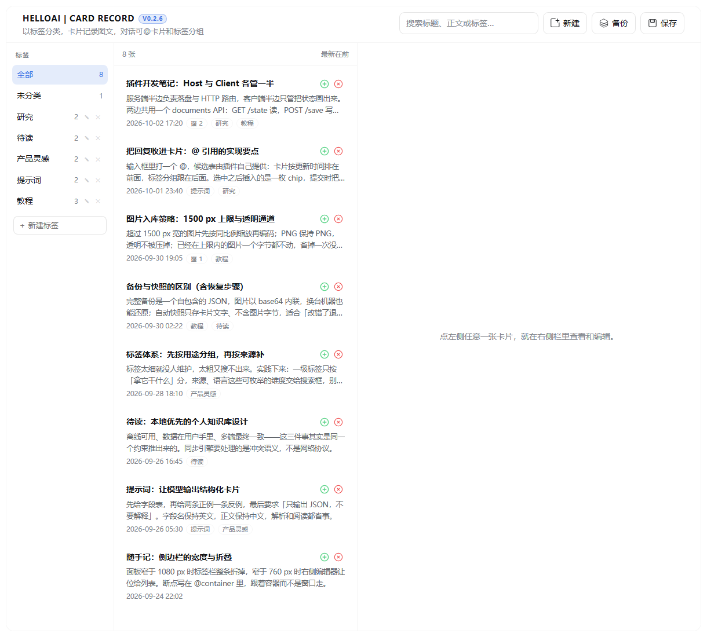

# HelloAI Works · DeepSeek Harness 卡片资料库

[](LICENSE)


**以标签分类，用卡片记录文字与图片，在对话里 `@` 就能把资料喂给模型。**

面板在左侧栏「插件」的正下方：左列是标签，中间是卡片列表，点任意卡片在**右侧栏**打开编辑——和 DSH 自带的文件预览、终端同一个位置，可拖动、可分栏、可并存。



*左列标签，中间卡片列表，点任意一张卡片就在**右侧栏**打开编辑——和 DSH 自带的文件预览、终端同一个位置，可拖动、可分栏、可并存。*

<details>
<summary>点击看面板单独的样子（深色 / 浅色）</summary>




</details>

## 它能做什么

- **标签分类**：新建标签、重命名、删除；**重命名成已存在的名字会自动合并**，这也是把打错的标签并回正轨的唯一方式。删标签只删标签本身，卡片保留、变成未分类。
- **文字 + 图片卡片**：正文按块排列（文字块 / 图片块），支持搜索（标题 / 正文 / 图片说明 / 来源 / 标签名）、最新或最早排序。
- **对话里 `@` 引用**：输入框打 `@`，菜单里多出「卡片资料」一栏。草稿里只显示卡片标题，**发送时才展开成卡片全文**——写小说时 `@人物设定` 当上下文，正是这个用法。
- **还能整组调用**：`@` 菜单里除单张卡片外还有**标签分组**，选中一个标签 = 把这个标签下的卡片**整组**带进上下文。
- **图片按内容寻址**：图片以 SHA-1 存成 `assets/<sha1>.<ext>`，同一张图插多少次都只占一份；宽度 > 1500 px 才等比缩小，**缩小时 PNG 仍是 PNG**（透明通道保留），GIF / SVG 永不重新编码。
- **一个文件夹就是一个资料库**：`<DSH_HOME>/helloai-works/`，不用本插件也能读、能拷、能用网盘同步、能丢进 Git。卸载 DSH 后数据照样在。
- **不丢东西**：编辑防抖 800 ms 自动保存；保存带乐观锁版本号，冲突返回 409 并**原样保留你的改动**，覆盖还是放弃由你选；每 10 分钟一份文档级快照（留最近 30 份），随时可导出**图文全在一个文件里**的完整备份。

## 安装

```bash
dsh plugin --profile desktop add github:hello-heyongping/dsh-helloai-works
```

或者 clone 到本地再装（想改代码就用这个）：

```bash
git clone https://github.com/hello-heyongping/dsh-helloai-works.git
cd dsh-helloai-works
dsh plugin --profile desktop add .
```

> 把 `desktop` 换成你自己的 profile 名。仓库里**已经带上构建好的 `lib/`**，不需要先 `npm install`。

装完**刷新页面**，左侧栏「插件」正下方就是「卡片资料」。面板头部会显示版本角标（例如 `V0.2.6`）——刷新后看角标就知道页面是不是最新构建。

## 快速上手

1. 点左侧栏的「卡片资料」打开面板；
2. 底部输入框新建一个标签（比如 `人物`），回车；
3. 点右上角 **新建** 建一张卡片，标题 + 正文块 / 图片块随你加；
4. 想引用时，在**对话框输入框里打 `@`** → 选「卡片资料」或「标签分组」；
5. 数据都在 `<DSH_HOME>/helloai-works/` 下，直接拷走就是备份。

粘贴 / 拖入 / 选择图片都可以；单张上限 32 MB（base64 后）。

## 常见问题

**卸载 DeepSeek Harness 后我的资料还在吗？**
在。数据在 `<DSH_HOME>/helloai-works/`（默认 `C:\Users\<用户名>\.dsh\helloai-works`），属于用户目录，卸载只删程序本身。

**怎么恢复？**
三种都行：① 重装 DSH 和插件，同一个 `DSH_HOME`，打开就是原样；② 用之前下载的 `works-full-*.json` 在备份抽屉里「导入备份」；③ 只要 `helloai-works` 文件夹还在，直接拷回 `DSH_HOME` 即可，插件不需要任何登记。

**`@` 菜单里没有「卡片资料」？**
那说明这个 DSH 版本不带触发器服务，面板头部会写明「未接入」。此时只有 `@` 引用这一项不生效，插件其余部分照常。

**「清理未引用图片」能当日常操作吗？**
不建议。它会让旧快照缺图，清理前先做一次完整备份。

**改了代码要重启 DSH 吗？**
客户端改动 `npm run build` 后**刷新页面**即可。Host 改动需要**完整重启**——`webServer.register({kind:"prefix"})` 注册的前缀路由在插件 dispose 时不会释放，运行中禁用再启用会报 `duplicate prefix route`，改动不生效但也不会把插件弄坏。

---

> 下面是完整的实现说明、性能实测与更新记录，写给想改代码、或想搞清"为什么这么设计"的人。

DeepSeek Harness 的卡片资料库：以**标签分类**，用**卡片**记录文字与图片，卡片内容在**右侧栏**里查看和编辑。

- 入口在左侧栏「插件」的正下方（面板 `order` 排在插件 `0` 与日程 `10` 之间）。
- 左侧面板 = 标签栏 + 卡片列表（标题 / 正文摘要 / 收集时间 / 图片数）。
- 点任意卡片 → 在右侧栏打开一个「卡片」标签页，与 DSH 自带的文件预览、终端同一个位置，可拖动、可分栏、可并存。
- 没有会话（右侧栏不可用）时，同一条卡片界面会退回面板内显示，功能不丢。
- 全部配色走 `--dsw-*` 主题变量，换主题即换风格；图片统一 14px 圆角，图 + 文按块排列。
- 头部沿用 HelloAI 家族的样式，固定**两行**，靠字号与深浅区分层级：第一行 `HELLOAI | CARD RECORD` 品牌字（14px、主文本色）+ `V0.2.6` 版本角标；第二行是一句**淡色**副标题 `以标签分类，卡片记录图文，对话可@卡片和标签分组`（13px、三级文本色 `--dsw-alias-label-tertiary`，不再用分隔符拼两段）。与「技能管理」「备份与恢复」两个插件同一套处理（各自用独立类名前缀，避免全局样式互相踩）。版本角标在构建时取自 `package.json`，所以升级只改那一个数字——**刷新后看角标就知道页面是不是最新构建**。第二行里的 `@` 也是本会话的实况：接入时这句本身就是提示，**未接入时才**在句尾追加一行主题警告色的说明（`@ 引用未接入（触发器服务不可用）`），平时不占位置。
- 头部右上角是 `新建 / 备份 / 保存` 三个按钮：图标是**内联 SVG**（带加号的窗口 / 层叠三片 / 软盘），不是 `＋ ⛁ 💾` 这类文本字符，所以字形不随系统的 emoji 字体变化；三条路径一律 `fill="currentColor"`，跟着按钮的配色走。三个按钮**样式统一**——只有边框、没有填充，谁也不是"主按钮"，鼠标悬停时才亮起底色与主色描边。
- 支持搜索（标题 / 正文 / 图片说明 / 来源 / 标签名）、最新或最早排序、标签增删改。
- 卡片页正文只留**标签 + 内容块**：`来源` 是可选字段，收成「收集于」日期旁的**链接图标**，点一下才展开输入框，平时不占位置。
- 备份抽屉里带一份**「数据说明」**（默认展开，中英双语）：数据存在哪、图片怎么存怎么压、完整备份和快照各含什么、卸载 DSH 后数据还在不在、怎么恢复，以及保护数据的五条习惯。
- **在对话里 `@` 引用卡片**：输入框打 `@`，菜单里多出「卡片资料」一栏，选中即插入一个引用标签；草稿里只显示卡片标题，发送时自动展开成卡片全文——写小说时把「人物设定」@ 进来当上下文，正是这个用法。

## 标签与卡片的增删改

**标签**（左侧栏）

| 操作 | 怎么用 |
| --- | --- |
| 新建 | 底部输入框回车；名字已存在时直接复用，不会建重复的 |
| 重命名 | 悬停标签行点 `✎`，或双击标签名 |
| 删除 | 悬停点 `✕`。**只删标签本身**，卡片保留、变成未分类 |
| 合并 | 重命名成已存在的名字即**自动合并**：卡片转到那个标签，旧标签消失。这也是把打错的标签并回正轨的唯一方式 |
| 空名字 | 拒绝并提示，标签保持原样 |

**卡片**（中间列表）

| 操作 | 怎么用 |
| --- | --- |
| 打开 / 编辑 | 点整行 → 在右侧栏打开 |
| 复制 | 悬停点 `⧉`：副本插在原卡片后面，标题加「（副本）」，**块 ID 全部重新生成**（两张卡不会共用同一段） |
| 删除 | 悬停点 `🗑`，需确认 |
| 改标题 / 标签 / 文字块 / 图片块 | 右侧栏卡片页 |
| 改收集时间 | 卡片页顶部「收集于」是日期选择器，只改日期、保留原来的时分秒——这是卡片上唯一一个别处改不了的字段 |
| 改来源 | 就在「收集于」日期旁边的**链接图标**：来源是可选项，平时只占一个图标（有来源时图标变主色，悬停显示内容），点一下才在标题下展开输入框，回车 / 失焦收起 |

标签行和卡片行的操作按钮平时是**半可见**的（`opacity: .4`），悬停或键盘聚焦时变实。纯 hover 才出现的控件用起来就像功能没做——这一版就是为此改的。

## 磁盘结构

整个资料库就是 `DSH_HOME` 下的一个文件夹，不用本插件也能读、能拷、能同步：

```
<DSH_HOME>/helloai-works/
  works.json              文档：标签 + 卡片（不含图片字节）
  assets/<sha1>.<ext>     收集到的图片，按内容寻址，同一张图只存一份
  backups/                轮转快照（只含文档）+ 自包含完整导出（图文全在）
```

图片**不进文档**：文档始终只有几 KB 到几百 KB，浏览器按普通图片缓存字节，加一张图不需要重写整个库。

同一个文件夹可以直接用网盘同步、整体拷贝、丢进 Git；里面的图片就是普通图片文件，不装本插件也能打开看。

## 图片：存放与压缩

粘贴 / 拖入 / 选择进来的图片，先在浏览器里按下面的规则处理，再以 base64 上传，Host 端按 **SHA-1** 存成 `assets/<sha1>.<ext>`：

| 情况 | 处理 |
| --- | --- |
| 宽度 > **1500 px** | 等比缩小到宽 1500 px（高度按同一比例），再编码 |
| 宽度 ≤ 1500 px | **一个字节都不动**：不重新编码、不掉画质 |
| 需要缩小时的格式 | PNG 仍是 **PNG（透明通道保留）**，WebP 仍是 WebP；JPEG / BMP / AVIF → JPEG（质量 0.88） |
| GIF / SVG | 原样保留，永不重新编码（动图与矢量过不了 canvas） |
| 单张上限 | 32 MB（base64 后），Host 端兜底；超出会明确报错 |

内容寻址带来两个直接好处：同一张图插入多少次都只占一份；图片文件与卡片是**两份独立拷贝**——删掉电脑上的原图不影响卡片，反过来在插件里删卡片或删图片块也**不会**立刻删文件，只有点「清理未引用图片」才会删掉没有任何卡片引用的图片。

## 数据保护：怎么不丢东西

**数据在哪**：`DSH_HOME`（默认 `C:\Users\<用户名>\.dsh`）下的 `helloai-works` 文件夹。它属于**用户目录**，与 DeepSeek Harness 的程序安装目录无关。

**卸载 DeepSeek Harness 后数据还在吗**：在。卸载只删程序本身，`helloai-works` 文件夹原封不动——除非你手动删除，或用清理工具删掉了整个 `.dsh`。

**怎么恢复**：

1. 重装 DSH 和本插件 → 同一个 `DSH_HOME`，文件夹还在，打开就是原样；
2. 换了电脑或数据被删 → 用之前下载出去的 `works-full-*.json`，在备份抽屉里「导入备份」（导入前会自动先存一份快照）；
3. 只要 `helloai-works` 文件夹还在（哪怕一份备份文件都没有）→ 直接拷回 `DSH_HOME` 即可，插件不需要任何登记。

**五条习惯**：

1. 定期「生成完整备份」**再点「下载」**，把文件存到另一个盘 / U 盘 / 网盘——只留在 `backups/` 里，磁盘坏了会一起没；
2. 整个 `helloai-works` 文件夹用网盘同步，等于随身带一份副本；
3. 别把「清理未引用图片」当日常操作：它会让旧快照缺图，清理前先做一次完整备份；
4. 自动快照只保留最近 30 份、且只含文字，重要的时间点自己导一份完整备份；
5. 卸载、重装或换电脑之前，先导一次完整备份。

以上内容也原样写在插件的**备份抽屉**里（「数据说明」，默认展开），中英文各一份。

## 在对话里 `@` 引用卡片

写小说要一直带着人物设定、世界观、章节大纲——把它们做成卡片，然后在输入框里 `@` 进来：

1. 打 `@`，菜单里和自带的「文件 / 会话」并列多出一栏 **卡片资料**；
2. 继续打字就是搜卡片（标题、来源、正文、图注、标签名都能搜，用的是和左侧面板同一个检索索引）；
3. 选中后插入的是一个**引用标签**（草稿里显示卡片标题，不会把正文糊你一屏）；
4. 点标签可以在右侧栏打开这张卡；发送时，标签才会**展开成卡片全文**交给模型。

那栏里除了单张卡片，还有**标签分组**：选中一个标签 = 把这个标签下的卡片**整组**带进上下文。写小说时 `@人物` 一次带齐所有人物设定，比一张张点省事——这就是"用 `@` 调用资料库数据"的完整形态：**单片调用**（一张卡）+ **成组调用**（一个标签）。

模型实际收到的是这段文本（截取上限 8000 字，超出会注明被截断）：

```
【卡片资料：人物设定】
标签：设定、主角
来源：https://example.com/notes/12
收集于：2026-10-03

林见微，28 岁，旧城修复师。左手腕有一道旧伤……
［图片：人物立绘 v2］
```

几个实现上的取舍，写在这里免得以后忘了为什么：

- 走的是 DSH 官方的**触发器管线** `ctx.inputTriggers.registerSource()`（`@` 是共享触发器，一个字符一个菜单、一个来源一栏），没有替换任何自带 UI，也没有改动 DSH 自身文件——本插件只往这个公开服务里注册一个来源。菜单按来源的 `order` 排序，本插件用 `-1` 排到自带来源前面。
- 拿到这个服务有三条路（服务已在 / cordis 注入 / 服务注册事件），哪条先到用哪条；都没有（某个 DSH 版本不带触发器服务）时只有这一项功能不生效，面板头部会写明「未接入」。
- 草稿里是标签、发给模型是全文，靠的是这条管线里来源自己的 `codec.serialize()`——提交时由它把引用序列化成提示词；序列化失败会让整次发送卡住，所以**卡片中途被删**时这里返回的是一句说明而不是抛错。
- 只引用**你选中的**卡片（或标签）：没点的卡片不进上下文，模型也不知道你的库里还有什么。
- 图片只带图注、不带字节（模型看不到 `assets/` 里的文件）；卡片太长会被截断（单张 8000 字），这是刻意的——引用会在**每次提交**时展开，不限长的卡片是给自己挖坑。
- **整组引用另外设了总预算**（一个标签最多 20000 字），装不下的卡片会在文本末尾注明"还有 N 张未展开"，而不是悄悄少给——缺了却没说的上下文，比说明白的更糟。
- 提示词里的每一句（卡片标题 / 标签 / 来源 / 日期 / 图注 / 截断说明 / 已删除的降级话术）都走 i18n，中英各一套，跟着界面语言走。
- 服务由兄弟客户端包提供，本插件用 `ctx.get("inputTriggers")` **可选**获取：万一某个 DSH 版本没有这个服务，只有「@ 引用卡片」这一项不生效，插件其余部分照常。

## 规模与性能（实测）

先分清两件事：**备份文件**和**日常数据**。

- `backups/works-full-*.json` 只在「生成完整备份 / 下载 / 导入」时被读写，**查看和搜索根本不碰它**——所以备份用 JSON 不会拖慢日常使用，它只占磁盘、并且生成那一下比较重（见下）。
- 日常速度只取决于 `works.json`：整个文档在页面加载时读进内存，搜索、筛选、排序全在内存里做，保存时整份写回。

`npm run bench` 会现场量一遍（每张卡片按 2 段文字约 300 字 + 1 张图片引用计；图片字节不在 `works.json` 里，不计入）：

| 卡片数 | works.json | 首次加载解析 | 每次保存序列化 | 建索引 | 切换标签/排序 | 每次按键搜索 | 旧实现 |
| ---: | ---: | ---: | ---: | ---: | ---: | ---: | ---: |
| 500 | 0.41 MB | 1.4 ms | 1.5 ms | 1.0 ms | 0.1 ms | 0.1 ms | 0.6 ms |
| 2,000 | 1.65 MB | 5.4 ms | 6.2 ms | 3.7 ms | 0.4 ms | 0.3 ms | 2.5 ms |
| 5,000 | 4.13 MB | 14 ms | 16 ms | 8.9 ms | 1.0 ms | 1.1 ms | 6.3 ms |
| 20,000 | 16.62 MB | 58 ms | 61 ms | 37 ms | 4.6 ms | 4.9 ms | 23 ms |

Windows 11 / Node 24 本机实测，取中位数；搜索一列用「哪张卡片都不含的词」这一最坏情况（不给任何短路机会）。

据此：

- **搜索不会因为备份而变慢**：一次按键就是一次子串扫描，5,000 张约 1 ms。
- **小写化只做一次**：`buildSearchIndex()` 在文档变化时给每张卡片建一条全小写的检索串（标题 + 来源 + 每个块的文字/图注 + 标签名），按键时只做子串比较，比「每次按键重新小写整张卡片」快 5–6 倍。
- **排序只在切标签 / 切排序时发生**：输入关键词不会重排列表。
- **真正的天花板是列表 DOM**：面板目前把可见卡片**全部**渲染成行；这一项没在 Node 里量过，按经验 1–2 千行仍然流畅，再多就该上窗口化（见路线图）。
- **完整备份会很大**：图片按 base64 内联（体积约 +37%），按压缩后每张 300 KB 估算，500 张图 ≈ 200 MB、2,000 张 ≈ 800 MB。它只在生成/下载/导入那一刻出现，但生成时 Host 要在内存里拼出整个文件——图片特别多时，更稳的做法是直接备份 `assets/` 文件夹本身（见上节）。

## 保存模型（当前实现）

| 环节 | 做法 |
| --- | --- |
| 触发 | 编辑后防抖 800 ms 自动保存；`保存` 按钮、页面隐藏时也会立刻提交 |
| 请求 | `POST /save { doc, baseRevision }` —— 提交**整份**文档 JSON，并带上乐观锁版本号 |
| 冲突 | `baseRevision` 与磁盘不一致 → **409 + 当前文档**；本地改动**原样保留**，弹出两个选择：用我的改动覆盖 / 放弃我的改动 |
| 空写 | 内容与磁盘一致时不写盘、不加版本号（只有时间戳漂移的重复保存会被吃掉） |
| 落盘 | 写临时文件 → `fsync` → 原子 `rename` 覆盖 `works.json` |
| 快照 | 每 10 分钟最多一次，**文档级**副本进 `backups/`（只含卡片文字，不含图片字节），保留最近 30 份 |
| 完整备份 | `生成完整备份` 把被引用的图片内联成**一个自包含 JSON**（图文都在同一个文件里），写进 `backups/` 并可下载 |
| 导入 | 用备份文件整体替换（替换前自动存一份快照） |

一句话：**整库一个文件，整份原子覆盖，带乐观锁**。优点是极简、可读、可拷贝、导出即备份；代价见下节。

冲突期间自动保存会**停在原地**，不反复重试、更不会覆盖对方。未决冲突的提示条没有关闭按钮，避免把未保存的改动丢掉；这条提示也会跟到右侧栏的卡片页里，因为冲突是一个必须做的决定，不是一条过眼消息。

## 已知取舍

1. **写放大**（唯一剩下的结构性问题）：真正的编辑仍会整份重写文档。实测 5,000 张约 4.1 MB / 16 ms，20,000 张约 16.6 MB / 61 ms（`npm run bench`）。内容一致时已经跳过写入。
2. **UI 线程序列化**：保存前 `JSON.stringify` 整份文档，20,000 张约有 60 ms 的卡顿。
3. **没有单卡历史**：快照是整库级的，撤销不了「某张卡片的上一次编辑」。
4. **冲突靠用户裁决**：不做字段级自动合并，覆盖或放弃是二选一。对个人资料库这是刻意的——猜错的自动合并比让用户选一次更糟。

## HTTP 接口

前缀 `/api/dsh-helloai-works`，只接受本地或受信来源。

| 方法 | 路径 | 作用 |
| --- | --- | --- |
| GET | `/state` | 文档 + 已有图片 id + 存储路径 |
| POST | `/save` | 覆盖保存整份文档；带 `baseRevision` 时做乐观锁，版本不符返回 409 + 当前文档 |
| POST | `/asset` | 上传 base64 图片，按 sha1 去重，返回 id |
| GET | `/asset/<id>` | 图片字节，`immutable` 长缓存 |
| GET | `/backups` | 备份文件列表 |
| POST | `/backups/restore` | 用某份备份覆盖当前资料 |
| POST | `/backups/delete` | 删除某份备份 |
| POST | `/export` | 生成自包含完整备份文件 |
| GET | `/download?name=&offset=&length=` | 分块下载备份（桌面端自定义协议扛不住大响应体） |
| POST | `/import` | 用备份内容整体替换 |
| POST | `/collect` | 清理没有被任何卡片引用的图片文件 |

## 开发

```bash
npm install
npm run typecheck     # tsc --noEmit，strict
npm run build         # esbuild：Host → lib/index.js，客户端 → lib/client.js
node scripts/selftest.mjs   # 195 项检查
npm run trigger:check       # 单独复现/验证 `@` 来源的 Promise 契约（见 v0.2.5）
npm run bench               # 规模实测：文档体积 / 解析 / 保存 / 搜索耗时
```

`scripts/selftest.mjs` 用临时 `DSH_HOME` 起一个真 socket，分四段跑，最后再补一项生命周期检查：

1. Host —— 保存 / 图片往返 / 乐观锁 / 导出 / 导入 / 恢复 / 清理 / 路径穿越拒绝；
2. 客户端 —— 把构建产物塞进一个假的 `window.__ModuleLoader__`，用 `react-dom/server` 渲染面板、卡片页、chip 和**备份抽屉**，检查「数据说明」七问七答都在且中英双语都写全了、插图策略（>1500 px 等比缩小、PNG 缩完仍是 PNG、预算内的图不重新编码、GIF/SVG 不动）正确、`apply` 只往触发器管线里注册**一个** `@` 来源，并检查**没有任何颜色属性写死字面量**（只能经由 token 兜底）；
3. 冲突 —— 直接驱动客户端 store 打真实接口，验证「另一个窗口先写 → 本窗口保存 → 409 → 保留本地改动 → 覆盖 / 放弃」两条路径；
4. 增删改 / 检索 / `@` 引用 —— 同样走真实接口验证标签与卡片的增删改；然后用同一份文档验证检索（标题 / 来源 / 正文 / 图注 / 标签名各字段都能搜到、大小写无关、跨字段不会误命中、标签筛选与新旧排序），并直接驱动 `@` 来源：候选列表、按正文和标签名过滤、选中的落点（引用标签指向哪张卡）、`codec.serialize` 展开出的提示词（含标签 / 来源 / 日期 / 正文）、卡片被删后的降级文本、超长卡片截断，以及点标签开卡。

`scripts/bench.mjs` 不判定成败，只打印上表那组数字；它是**测量**而不是测试，卡片数可以自己传（`node scripts/bench.mjs 100000`）。

### 想对照 DSH 自带实现的源码

DSH 装完是打包在 `resources/app.asar` 里的，自带插件（`@deepseek-ai/dsh-client-ui-input-trigger`、`…-ui-reference`、`…-ui-commands`）的源码可以直接从里面读出来——v0.2.5 那个 `@` 卡骨架的问题就是这么定位的（自带来源都是 `async`，本插件当时是同步返回数组）：

```bash
# 列出包里某个插件的文件
python .cache/tools/asar.py "D:/DeepSeek Harness/resources/app.asar" list ui-input-trigger
# 导出到 .cache/dsh-asar 下细读
python .cache/tools/asar.py "D:/DeepSeek Harness/resources/app.asar" dump .cache/dsh-asar ui-input-trigger
```

`.cache/tools/asar.py` 就这两个子命令（`list` / `dump`），只读、不改动安装目录。

### 改 Host 代码要重启 DeepSeek Harness

**客户端**产物是每次请求现读磁盘的：改完 `npm run build`，**刷新页面**就是新版——本插件的功能升级（面板、卡片页、备份抽屉、`@` 引用、插图压缩）全在客户端，所以升级插件不需要重启 DeepSeek Harness。`@` 引用要用的触发器服务由兄弟客户端包提供，本插件用 cordis 的 `ctx.inject(["inputTriggers"], …)` 注入，服务**无论先注册还是后注册**都会接上，不依赖加载顺序。

**Host** 不是：`webServer.register({kind:"prefix"})` 注册的前缀路由在插件 dispose 时不会释放。所以在运行中的进程里禁用再启用本插件，会看到

```
webserver: duplicate prefix route "/api/dsh-helloai-works"
```

新实例起不来，旧实例继续服务——即**改动不会生效，但也不会把插件弄坏**。改 Host 代码后请完整重启一次 DeepSeek Harness。排查时若 `POST /save` 传一个过期的 `baseRevision` 仍返回 200，就说明跑的还是旧构建。

## 安装

```bash
dsh plugin --profile <profile> add "D:/DeepSeek Harness plugin/dsh-helloai-works"
```

或手工在 profile 的 `package.json` 里加：

```json
"dsh": { "profile": { "bundles": [ "...", "@hello-heyongping/dsh-helloai-works" ] } },
"dependencies": { "@hello-heyongping/dsh-helloai-works": "link:D:/DeepSeek Harness plugin/dsh-helloai-works" }
```

## 更新记录

### v0.2.6 · 修掉「点『加入到卡片资料』后界面错乱」

- **症状**：在会话里点助手消息那一行的 ⊕（加入到卡片资料），弹出来的不是一个居中的对话框，而是**一堆浏览器原生控件堆在窗口左上角**——标题/内容/标签/取消/保存全都裸着，盖住了侧栏、标题栏和 logo，看着就是「界面错乱」。同一个按钮平时也显示成一块**灰色实心方块**，而不是方框加号。
- **原因**：这个功能的两处皮肤（消息行按钮 + 草稿对话框）都只靠 `CollectLayer` 内部渲染的一个 `<style>` 节点供样式。那个节点在 `shell.overlay` 插槽里，一旦它不在文档里（插槽占用者被换掉、模块被 HMR 重载、该节点被别的东西清掉），按钮就退回成**原生 `<button>`**（深色主题下就是那块灰方块），对话框也退回成**无样式的块级元素**——`position:fixed` 的遮罩和居中都没了，于是整坨东西落在文档左上角。换句话说：**样式表的送达方式太脆**，而不是对话框写错了。
- **修法**（`src/collect.tsx`）：
  1. 样式表改成**注入 `document.head`**（`id="hxw-collect-style"`，幂等、不重复）：模块求值时注入一次，`CollectAction`、`CollectLayer` 每次挂载/开合再断言一次，HMR 重载后自动刷新同一个节点。文档头是「不管哪个 React 树挂着都还在」的地方。
  2. 关键几何改成**内联样式兜底**：按钮尺寸/无边框、遮罩 `position:fixed;inset:0;display:grid;place-items:center`、对话框宽度/最大高度/圆角/底色，以及标题、内容、标签输入框和底部按钮的外观，都与样式表里的值一致（内联优先，所以有样式表时观感一模一样）。**万一样式表真的丢了，对话框仍然是一个居中、可读、能用的模态框**，不再堆到左上角。
  3. 图标补上 `fill-rule="evenodd"`：方框和加号是同一路径里的三个子路径，靠缠绕方向挖洞不够稳，显式声明填充规则后「方框 + 加号」是确定的。
- **自检**：`npm run typecheck && npm run build && node scripts/selftest.mjs && node scripts/check-trigger-contract.mjs`。
- 顺手把头部第二行收敛成**一句淡色文案**：`以标签分类，卡片记录图文，对话可@卡片和标签分组`（13px、三级文本色，去掉分隔符）。`@` 接入时这句话本身就是提示，只有**未接入**时才在句尾追加主题警告色的一行，平时不占位置。版本角标仍是 `V0.2.6`。
- **升级后请看版本角标**：面板头部应显示 `V0.2.6`。若还是旧角标，说明这个页面仍在用**浏览器缓存的旧 bundle**——刷新（或在应用里重开一次窗口）即可；旧 bundle 正是这个错乱的来源。

### v0.2.5 · 修掉「`@` 卡在骨架态」

- **症状**：输入框打 `@`，菜单弹出来但一直是两行灰色骨架，一张卡片都不显示（`/` 指令菜单、`@文件` 也一起不出）。
- **原因**：DSH 的触发器管线是用 Promise 收尾的——`source.candidates(...).then(...)`。本插件的 `candidates()` 是**同步函数、直接 return 数组**，数组没有 `.then`，于是这一句在菜单的取数循环里抛 `TypeError`；循环就此中断，`source-settled` 再也不会派发，**排在后面的来源也一并烂在 `pending`**，而 `pending` 且没有旧行的分组渲染出来就是那两行骨架。自带来源都是 `async`，所以只有装了本插件的环境会看到这个现象。
- **修法**：`candidates()` 改成 `async`（`src/mention.ts`），这样**所有分支**（包括提前 `return []`）返回的都是 Promise；同时顺手尊重管线给的中止信号。
- **防回归**：`node scripts/check-trigger-contract.mjs` 用管线那一句的真实写法跑两个来源——返回裸数组的会当场抛错并把后面的来源一起拖成 `pending`（复现原症状），本插件的来源则正常 settled 出 2 行；自检也加了两项在断言这个 Promise 契约（186 → 195 项）。
- 顺手修掉自检本身的一个**偶发红灯**：客户端这一段让 store 的预加载请求打到了进程自带的 `fetch` 上（相对路径解析不了），失败重试要好几秒，那条「读取失败」的状态更新会落在第 4 段的编辑中间，把刚写的标签/卡片冲掉，于是随机报错。现在这一段有了自己的 documents 服务替身，并断言没有任何请求漏到网络上——连跑 6 次全绿。
- 若哪个 DSH 版本把 `candidates` 当同步函数调用，`async` 的返回值仍是「一个 thenable 的东西」，不影响兼容。

### v0.2.2 · `@` 排到菜单最前 + 接线状态可见

- **`@` 菜单里「卡片资料 / 标签分组」排在最上面**：DSH 的触发器菜单按来源的 `order` 排序（自带的文件 / 会话来源是 0），本插件原来排在它们之后，容易一眼错过；现在 `order: -1`，打开 `@` 第一眼就是卡片。
- 插件激活时**预加载资料**：即使这个会话从没打开过左侧面板，第一次 `@` 也已经有数据。
- 面板头部多一行状态：`对话里输入 @ 即可引用卡片和标签分组`；万一某个 DSH 版本没有触发器服务，这里会明确写「未接入」，而不是静默失效。
- 接入方式改成三条路取先到者（服务已在 / cordis 注入 / 服务注册事件），任一条成功即注册，且只注册一次。
- 自检 183 → 186 项。

### v0.2.1 · `@` 也能整组调用

- `@` 菜单里除「卡片资料」（单张卡片）外，多出「**标签分组**」一栏：选中一个标签 = 把这个标签下的卡片**整组**带进上下文。`@人物` 一次带齐所有人物设定。
- 提示词措辞全部走 i18n（标题 / 标签 / 来源 / 日期 / 图注 / 截断 / 已删除的降级话术），中英各一套。
- 整组引用有独立总预算（20000 字），装不下的卡片会**注明**未展开。
- 自检 176 → 183 项。

### v0.2.0 · 插件功能升级

- **`@` 引用卡片**：输入框打 `@`，菜单里和「文件 / 会话」并列多一栏「卡片资料」；草稿里只放一个引用标签，发送时才展开成卡片全文。实现在新增的 `src/mention.ts`。
- **插图压缩**：宽 > 1500 px 等比缩小；**PNG 缩完仍是 PNG**（原来一律转 JPEG，透明背景会被压成黑色，这是修掉的一个真问题）；宽度合规的图一个字节都不动。
- **备份抽屉里的「数据说明」**：数据在哪、图片怎么存怎么压、完整备份和快照各含什么、卸载 DSH 后还在不在、怎么恢复、五条备份习惯——中英双语，默认展开。
- **卡片页的「来源」收成日期旁的链接图标**：可选字段不再占正文的位置，正文只留标签和内容块。
- **检索提速**：小写检索串只建一次、排序只在切标签/切排序时发生——5,000 张卡片的一次按键搜索从约 6 ms 降到约 1 ms（`npm run bench` 可复现）。
- 面板名从「资料卡片」改为「卡片资料」；自检从 106 项加到 176 项（v0.2.1 到 183 项，v0.2.2 到 186 项）。

升级方式：`npm run build` 后**刷新页面**即可——客户端产物每次请求现读磁盘，插件功能升级**不需要重启 DeepSeek Harness**。

## 路线图

- ~~**v0.2 冲突安全**~~（已完成）：保存带上 `baseRevision`，服务端不匹配返回 409 + 当前文档，本地改动原样保留，覆盖或放弃由用户选。
- **v0.3 索引化**：拆成 `index.json`（标签 + 卡片元信息）+ `cards/<id>.json`（正文块）。改一张卡只写约 2 KB，网盘同步也变成增量，顺手解决写放大。
- **v0.4 检索**：把全文检索做成**可重建的派生索引**（SQLite FTS5 或落盘的倒排表），纯文件仍是唯一事实来源，导出/备份的故事不变。（浏览器内那一步已经做完：见「规模与性能」的 `buildSearchIndex`。）
- **v0.5 卡片直达**：给每张卡片一个稳定地址，让会话里的引用、搜索日志和反向链接都能指向具体一张卡。
- **v0.6 列表窗口化**：卡片列表目前渲染全部可见行，上千行以后改成窗口化（虚拟滚动），这是眼下唯一还会随数据量变慢的界面部分。
- **v0.7 备份瘦身**：图片上千张时，完整备份改成分卷或「文档 + 图片目录」两种模式，避免生成一个几 GB 的 JSON。
